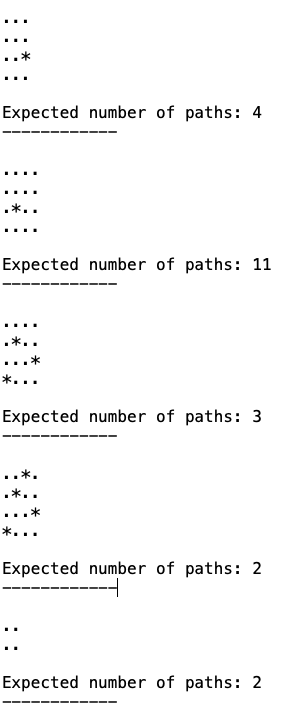

# Lösungen für Algorithmen-Vorlesung
Bisher ist nur die Lösung für https://cses.fi/problemset/task/1638/ vorhanden.

## GridResolver
Lösung für https://cses.fi/problemset/task/1638/  

Klasse: [GridResolver](./src/main/java/de/dhbw/cas/algorithmen/csesfi1638/GridResolver.java) und [GridResolverTest](./src/test/java/de/dhbw/cas/algorithmen/csesfi1638/GridResolverTest.java)  
Ausgabe des GridResolverTest:  
  